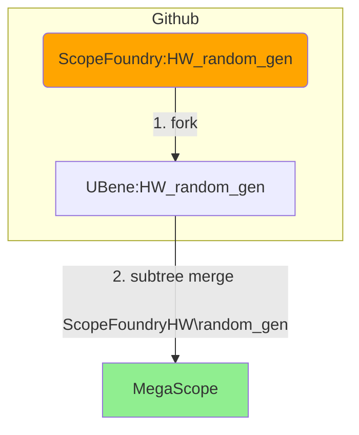

# Features


## import from GitHub

```
origin_repo = https://github.com/ScopeFoundry/HW_random_gen.git
my GitHub = UBene
```

produces repos:



Works without step 1. fork works as well. But I think there need to a GitHub repos for later pull requests.

Alternative. 

1. No git usage. Direct download and import to ScopeFoundryHW\
2. Using submodules: 
   1. drawback Mega scope does not track new module. (can update it)

## create new Hardware


Generates a hardware module from templates.

###### Benefits: 

- a standardized way of creating HW components. The template indicate some best practices.

###### Progress

   - [x] implemented 
   - [ ] Does run?
   - [ ] Check typos and best practices
   - [ ] Analog for new Microscope:
       - [ ] Questions: Should this include the random_gen HW?


## subtree push HW


###### Repos

   ```mermaid
   flowchart TD
       ScopeFoundryProject(ScopeFoundry:HW_company_model)
   	style ScopeFoundryProject fill:orange
   	id3[ScopeFoundry\plugin_manager\my_repos\HW_company_model.git]
   	id31[ScopeFoundry\plugin_manager\my_repos\HW_company_model]
   	id2[UBene:HW_company_model]
   	Megascope[MegaScope]
   	style Megascope fill:lightgreen;
   
   
   	Megascope -->|1. subtree push ScopeFoundryHW\company_model|id3
   	id3 -->|2A clone| id31 
       id31 -->|2B clone| id2
       
      	subgraph Github
   	ScopeFoundryProject <-.->|3. request fork clone or push| id2
       end    
   
   ```
###### Progress

   - [ ] implemented
      - [x] initial subtree push 
      - [ ] do we need step `2A clone`? Not sure
      - [ ] push after new commits
      - [ ] pull (from down stream) 
   - [ ] tests
	   - [ ] for HW created by users
        	- [ ] for imported modules or should this be handled separately?
   - [ ] Rewarding for sharing a HW: Promise authorship on ScopeFoundry project if they write you an email and you accept changes?


## Dealing with other modules.

What are other modules like

```
   MegaScope.sequencer
   MegaScope.confocal_measure
   MegaScope.nikon_microscope
      
   etc ...
```

Idea **subtree push analog to HW** thereby creating repos:

```
SFM_Sequencer
SFM_confocal
SFM_nikon_microscope
```


## Thoughts on defining complete MegaScopes:

#### Modular strategy:

1. D3: publish all modules required for a microscope and generate a sharable file

   1. option heavy: loops through all ScopeFoundryHW invoke B2 and all SFM and invokes C1 within a MegaScope project
   2. option light: tries to only publish modules required for a microscope. 

   Either way the sharable file is a list containing SFM and HW modules and their github repos. There could be a freezing option by also including a git commit id.

2. D4: Read in sharable files and pull all modules. 

###### Benefit and drawback

 - highly modular
 - harder to implement

#### Publish all on GitHub

Example

```
odmr_scope
 - ScopeFoundry
 - ScopeFoundryHW
 	- pulse_blaster
 	- ni_daq_gated_counters
 	- ...
 - odmr_measurements
 	- views
 	rabi.py
 	esr.py
 	data_browser_app.py
 	...
 	
 - app.py
```


###### Benefit and drawback:

 - simple!
 - no modularity.


###### Progress

None

   - [ ] name scheme
   - [ ] implementation analog to handling HW
   - [ ] feasibility

### Dependencies


```
- GitHub Account
- Terminal that:
  - git
  - git-cli (handy but can be removed)
  - bash (not sure if bash.exe installs globally with the terminal that comes with git)
```

###### Progress

   - [ ] Step by step instruction needed?

